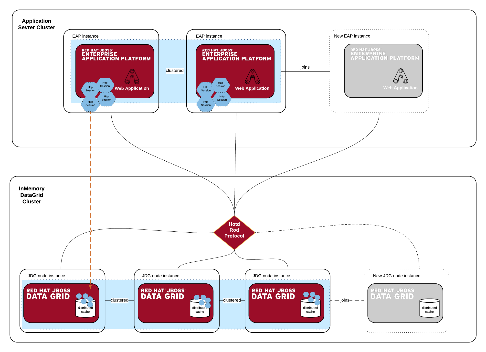
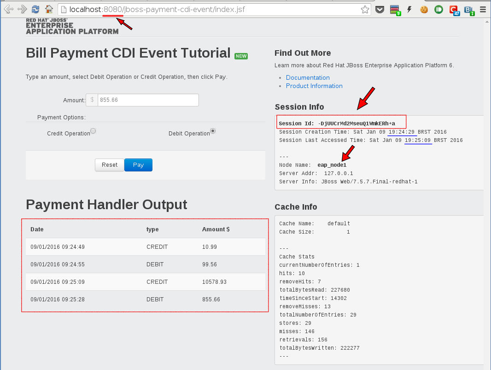
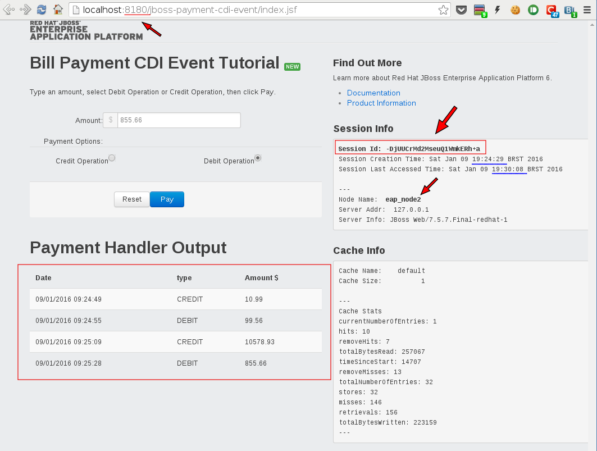

# JBoss EAP 6 Session Offload Demo
## Demo description
In this demo I'll show the new capability available in the *JBoss Data Grid 6.6*: [**Externalize HTTP Session from JBoss**](https://access.redhat.com/documentation/en-US/Red_Hat_JBoss_Data_Grid/6.6/html-single/Administration_and_Configuration_Guide/index.html#chap-Externalize_Sessions)

This capability allow us to externalize the HTTP Web Sessions from the Application Server to an external (remote) Data Grid cluster.
In some scenarios this can alleviate the Application Server memory consumption and improve the *availability* and *failover* of your Web Application User State. There are others great benefits this approach can bring to your setup:
 * **Cross data center state replication** - Session failover across remote data centers.
 * **Passivation of sessions to JDG** - Better memory utilization in EAP with short session timeouts.
 * **Transparent releases** (as long as session serialization is same between releases).

The nice thing about this capability offered By **JBoss EAP + JDG** is that it can be completely transparent for your code.
You don't have to change your code or implement any specific API.
This integration can be enabled just with a little of configuration in the EAP Caching subsystem.



## Software required for this demo

 * JDK >= 1.7
 * JBoss EAP >= 6.4
 * JBoss JDG >= 6.5
 * Apache Maven 3.x

## Environment

 * two JBoss EAP Standlone nodes (`standalone-ha.xml` configuration)
 * two JBoss JDG Clustered nodes (`clustered.xml` configuration)
 * two different Internet browsers
 * Terminal console

## Demo setup

 1. Clone (or [download](https://github.com/rafaeltuelho/jboss-middleware-demos/archive/master.zip)) this repository into your workstation
 ```
 git clone https://github.com/rafaeltuelho/jboss-middleware-demos.git

 cd eap-jdg-httpsession-offload-demo/
 ```
 2. Download the JBoss EAP and JDG binaries into `eap-jdg-httpsession-offload-demo/installs` subdirectory.
  * `jboss-eap-6.4.0-installer.jar` or `jboss-eap-6.4.0.zip`
  * `jboss-datagrid-6.6.0-server.zip`
 3. execute the `./init.sh` script

 > NOTE: if your running on Mac OS X you have to add a specific network `route` to your `loopback` interface:

 ```
 # multicast workaround on MAC OS X
 sudo route add -net 224.0.0.0/4 -interface lo0
 ```

 4. execute the `./servers.sh` script
 ```
 ./servers.sh start all
 ```

 5. follow the next session to test the demo.


## Testing

 * open the application in one browser window using the `eap_node1` instance: `http://localhost:8080/jboss-payment-cdi-event`
  * create some Payment entries(events) to store some data in the user web session.
  * observe the session and cache info on the right side of the page.
   * take a note of the Session ID (to compare when you go to another eap node instance in the cluster)

   

  * kill the `eap_node1` instance.
  ```
  ./servers.sh stop eap_node1
  ```

  * **in the same browser window (same session)** access the `eap_node2` instance: `http://localhost:8180/jboss-payment-cdi-event`
   * at this point you should see the same entries in the page.
   > NOTE: this is possible because the user session id (`JSESSIONID`) is persisted as a cookie in the browser.

 

 * add some more Payment entries...
 * now kill the `eap_node2` instance.
 * ok! all your JBoss EAP cluster is down!
 * make sure your sessions are still available in the JDG clustered cache:
  * use the JDG CLI to inspect the cache.
   * use the `stats` command to see the cache live information

 ```
 #JDG_HOME=./target/jboss-datagrid-6.6.0-server
 cd $JDG_HOME/bin
 ./cli.sh
You are disconnected at the moment. Type 'connect' to connect to the server or 'help' for the list of supported commands.
[disconnected /] connect localhost:10599
[standalone@localhost:10599 cache-container=clustered] cache default
[standalone@localhost:10599 distributed-cache=default] stats

 ```

 * Now bring the `eap_node1` instance UP again.
```
./servers.sh start eap_node1 0
```

 * open the app in the browser: `http://localhost:8080/jboss-payment-cdi-event`
 * you should see the same data!!!

---

## For detailed configuration used in this demo
To see the steps used to configure the EAP and JDG nodes for this demo see see the instructions [here](docs/env-configuration.md)
